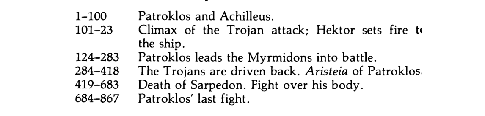
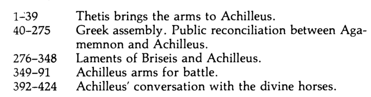
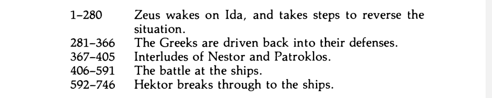
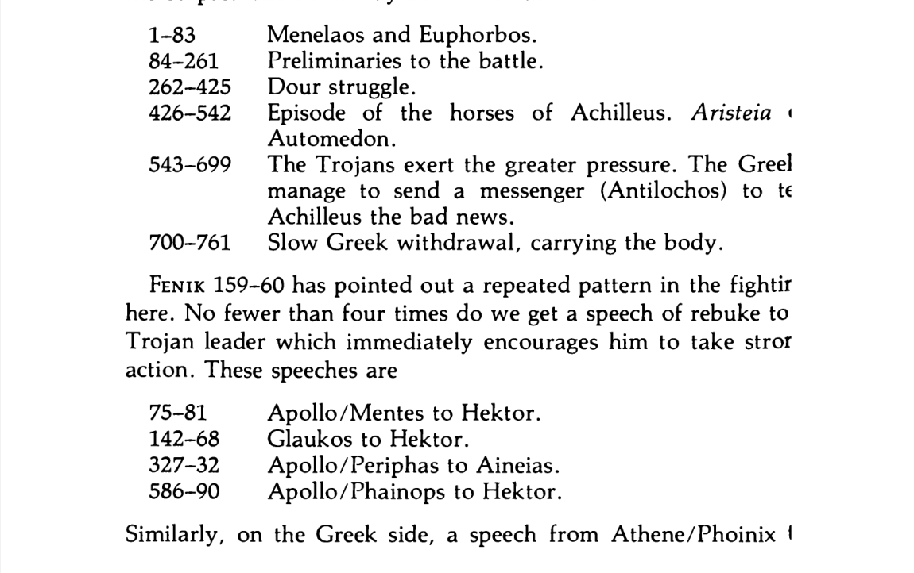
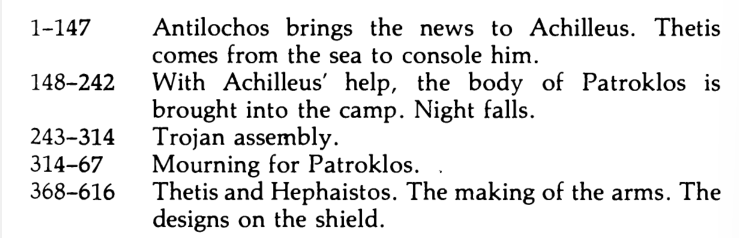

!!! info "Quick Summary of 13"
	- Zeus eases up on the Greeks for the next two chapters: the Trojan successes in Books 11 and 12 are the fulfilment of Zeus’ promise to Thetis in Book 1. 
	- At embassy in book 9: Achilles declares that he will not think of joining the battle again until "Hektor brought fire to his own ships" (9. 650-3). That ends up happening: at the end of Book 12 Hektor called on the Trojans to ‘wreck the ramparts of the Argives, and let loose the inhuman fire on their vessels’ (12. 440-1).
	- These events are actually really closely connected to 14-15 in which Poseidon inspires a rally of the Achaians when Zeus is distracted by the seductive charms of his wife Hera.
	- The "aristeia" (moment of glory) of Idomeneus in this book, and the infamous Deception of Zeus (Dios apate) in Book 14, both devices to delay the response of Achilles to the Achaians’ plight.

## 13 

- Zeus looking to other places is to indicate he is confident no gods will interfere with his actions. 
-  Powerful shaker of the earth = Poseidon. He is inspired to help Greeks, watching from island of Samothrake, vs. Zeus on Mt. Ida. Poseidon dislikes Troy because former king Laomedon refused to compensate him and Apollo for building the walls of Troy.

- Poetic balance, Mt. Ida is higher than Samothrake, Zeus' viewing horizon is farther, Poseidon closer. at Troy.

- Descent of Poseidon from mountain matches the descent of Apollo in 1.44-7:
	"So he spoke in prayer, and Phoibos Apollo heard him, and strode down along the pinnacles of Olympus, angered in his heart..."

- Poseidon's: 
	" So presently he came down from the craggy mountains, striding on rapid feet..."

- "Glorious house of Poseidon" was sanctuary of Aigai, modern day Vergina. This is mentioned in 8.203 (pg. 205). He goes here to arm himself and his chariot for battle. 
-  Kalchas speaks to the two Ajax's (Aiantes) and certain minor leaders, Thoas (Aitolian leader) to Idomeneus. 
- Hector reportedly being the "son of Zeus" is just an exaggeration to motivate the Ajax's 
- Son of Oileus = Minor Ajax, Son of Telamon = Greater Ajax. 
- Poseidon is in the form of Kalchas chewing Agamemnon out. Mirrors book 1 where Kalchas spoke on Agamemnon's injustice to Apollo. 
- Hector as rolling stone - reckless force. 
- Iris told Hector in 11.200-9 that he has Zeus' support, but he is deluded. It was only guaranteed until he reached the vessels. Zeus is looking elsewhere now, as said earlier. 
- Clash between Meriones and Deiphobos merely to set stage for Idomeneus.
- Imbrios is first to die. son in law of Priam. He then gets beheaded by Ajax minor.
- Amphimachos is grandson of Poseidon. His father was Kteatos, whose mortal fathor was Aktor, but real father Poseidon.
- Three of the best Greek soldiers were wounded, giving the lesser leaders time to shine. This is why Idomeneus is chosen. Also sent 80 ships to Troy.
- Deukalides = son of Deukalion, Idomeneus. 
- Fun fact about Idomeneus - his story is similar to the Biblical Jephthah. After Troy he promises Poseidon he will sacrifice first living thing he sees in order to have safe passage home. It is his son. 
- Zeus elder born:
	- Born to Kronos and Rhea. Kronos swallowed all of his children due to a prophecy, except Zeus.
	- Rhea replaced Zeus with a rock. Zeus then slew Kronos, his siblings remained infants within the belly of Kronos. 

- Idomeneus being described as greying is important bc it is physical tiredness that ends his aristeia. 
- **Othryoneus** offered to drive Achaians from Troy in return for the hand of Kassandra, daughter of Priam. 
	- It is presumptuous of a mere warrior to hope to marry into the royal family of Troy. Idomeneus later teases him about this when he wounds him, echoing  Agamemnon offering to Achilles in 9.142-7 (only a warrior like Achilles could receive hand of a princess).

- Asios was a Trojan commander, his death is forecast (12.116-17).  
	- He alone ignored Poulydamas’ advice to dismount from his chariot and attack the Achaian wall on foot. 

- Alkathoos was brother-in-law of Aeneas. 
- Aeneas was "forever angry with brilliant Priam" because they are two branches of the ruling dynasty. Rivals. 
	- This is shown later when Achilles mocks him that Priam will not reward him with the Trojan leadership even after he has dared to face Achilleus, because he has sons of his own to receive that honor (20. 180-3).
	- Also note that this mirrors Achilles (abstain from fighting due to anger towards superior).

- They're fighting around Alkathoos for his armor/to prevent stripping of his armor.
- Meriones going back to get his spear finally pays off, he injures Deiphobos as planned.
- Poseidon was father of king of Pylos Neleus, thus, Antilochos' great-grandfather.
- Euchenor makes same choice as Achilles, to die at Troy.
- We end with the Argives withstanding the Trojan onslaught.

## 14

- The action picks back up from both books 13 and 11. 
	- In 11.623-42 Nestor brought Machaon out of battle. and to his hut. The fighting is the same from end of book 13. 

- Nestor's son Thrasymedes takes his shield. 
- All three of the heroes coming towards Nestor: Odysseus, Diomedes. Agamemnon. 
	- All three were injured in book 11. 
	- Odysseus at 437, Agamemnon at 253, Diomedes at 377.

- The two divine interventions, that of Hera and Poseidon happen simultaneously but are narrated in sequence, that is why it seems like Ch. 13 never happened yet.
- Agamemnon worrying relates to Hector in 8.180-3 where Hector spoke of firing the ships.
- Agamemnon suggesting they run is in character:
	- He proposed that the Achaians flee at 2. 139-41, but the quick wits of Odysseus  helped
	- And again at 9. 26-8, when Diomedes opposed the proposal.
	- Note similarities between this strategy and Trojan Horse, which comes in the Aeneid.

- Agamemnon's fear of being berated is soon shown by Odysseus. 
- Agamemnon already gives way to Odysseus in 4.350-63.
- In contrast to when Odysseus defends Agamemnon in 2.204-6, he is implying Agamemnon has lost the *right* to rule. 
> Lordship for many is no good thing. Let there be one ruler, one king, to whom the son of devious-devising Kronos gives the sceptre and right of judgment, to watch over his people.

- Diomedes was already insulted twice:
	- Once when Agamemnon accused him of being a disgrace to his ancestors in 4.365-400
	- Nestor patronized his youth 9. 31-62
- This gives irony to his speech about being the youngest and his ancestors
- Diomedes’ father, Tydeus, fought as one of the Seven against Thebes (4. 376-8) 
- Poseidon once again shows up, already appearing as Kalchas (13.45) and Thoas (13.216) before.
	- He puts all the blame on Achilles. 
	- He encourages Agamemnon. likely foreshadowing their victory later in this chapter.

- Poseidon's roar necessitates the Deception of Zeus (Dios Apate).
	- It is very famous for its poetic quality, especially 346-51.
	- Three gods get deceived: Aphrodite, Sleep and Zeus.

- Hera is using her sex as a *weapon*, hence the long scene where she is getting prepared is her equivalent to the warrior suit-up scene.
- Here is claiming to be the foster child of Okeanos and Tethys, water deities. 
	- Strange as the story usually goes children of Ouranos (Earth) and Gaia (Heaven).
	- This may have been a shared creation story which is also referenced in Plato's Cratylus 402b, which came from Babylonian myths that name the gods of fresh and saltwater as primal elements.

- 5.638-51 Recalls Herakles' sack of city of Trojans, which Sleep recalls to Helen. Hera's punishment for this was referred to in Book 1 by Hephastos: dangled with anvils attached to her feet from Olympus 15.18-24.
- Night is the mother of Sleep, Hesiod's Theogony says she is an ancient deity, daughter of Chaos.
- The oath by the Styx is mightiest oath for the gods as we shall see soon (15.37-38).
	- According to Hesiod (Theogony 793-806), any god who breaks an oath sworn by Styx, the river of the Underworld, is condemned to lie for a year without breath or voice, and is then excluded from the company of the gods, from their banquets and their councils, for nine more years. 

- The scene when Zeus describes the unmatched arousal from seeing Hera mirrors that of 3. 441-6 where Paris declares he has never experienced such passion before Helen.
- Leto was goddess of motherhood, and bore Apollo and Artemis.
- Hera fearing being scene mirrors a scene from the Odyssey 8.361-66:
	- Hephaestus caught his wife Aphrodite sleeping with Ares by trapping them in a net.

- Poseidon can now help the Greeks openly as Zeus is sleeping. Rest of book goes as follows:
	- 352-401 Poseidon encourages Greeks to attack
	- 402-39 Ajax knocks out Hector
	- 440-507 Even battle, but Greeks have upper-hand. 
	- 508-22 Trojans flee.

- Once Hector is out of battle, his "alter-ego," the wits of Troy, Poulydamas takes over. He is meant for counsel, not a warrior. This foreshadows their incoming loss.
- Description of Ilioneus' death is gruesome. 
	- Image of the head of a poppy, seems to echo the simile comparing the dying Gorgythion to a drooping poppy (cf. 8. 306-8n).

## 15

- Homer established the Trojans winning in books 11/12 to get reversed in books 13/14
	- At the end of book 12: Achaian defenses breached, defeat looked inevitable. 
	- End of book 14: Achaian victory, Hector wounded. 
		- This is thanks for Poseidon in Book 13, Hera in Book 14.

- Homer's goal is Achaian defeat big enough for Patroklos to return to battle. 
- This book is here to restore the narrative to how it was at the end of Book 12. 
- The book comprises two sections: 
	- first a scene amongst the gods (1-262) continues the drama of the Deception of Zeus and serves to reassert Zeus’ authority.
	- The remainder of the book describes the consequence of this for mortals; the Trojan fortunes culminates in Hector calling for fire to hurl on the Achaian ships.

- The narrative is reversed: Trojans swarmed over the Achaian wall in (12. 459-71), the Achaian success has the Trojans going back across the ditch on the run. 
- Ajax = not the weakest Achaian, because he is strong.
- 15.18-30 refers to the Sack of Troy by Heracles
	- As recompense for not paying Poseidon and Apollo for the construction of Trojan walls, the Trojan king Laomedon was told by oracles to give his daughter, Hesione, as food to a sea monster; or else never-ending disaster for Troy.
	- Heracles promised to save Hesione if he could have some horses Zeus gave to Troy for taking prince Ganymede to be his lover.
	- Heracles saves Hesione, but Laomedon refuses to pay him.
	- **Heracles, Telamon (Greater Ajax's father) and Peleus (Achilles's father) then sacked Troy years later, killing Laomedon and leaving a young Priam alive.**
	- Hera blew Herakles off course with Sleep putting Zeus to sleep (she is also a sky goddess).
	- Zeus punished her by hanging her from a hook/beam. He threatens gods not to interfere, also referenced by Hephaistos in 1.590-3

- Hera tells Zeus a half lie: Poseidon acts of his own volition, and she covered herself in Book 14 by not specifically telling Sleep to speak to Poseidon; Sleep does it himself (14.354-55).
- Zeus's wishes:
	- Summon Iris to tell Poseidon to leave the fighting, and Apollo to heal Hector (Apollo is god of medicine).
- Zeus then reveals future events to Hera.
- Trojan Horse is referenced: "...capture headlong Ilion through the designs of Athene." In Odyssey 8.493 Odysseus was advised by Athena on this matter.
- Zeus establishes a causal relationship between Patroclus's death and Achilles's wishes when he says **"the thing asked by the son of Peleus."**
- Themis is a titan, goddess of justice.
- Askalaphos, Ares' son, is killed in 13.518. Ares didn't know of this, because he was at Olympus on Zeus's orders 13.521-25.
	- Ares would have to change sides to avenge his son, a Greek. He was supporting Troy due to his lover, Aphrodite, being loyal to Paris. 
	- **Ares strikes his thighs with palms: this portends imminent death, like Achilles when he sends Patroclus in 16.125**
- In 4.439-40 Fear, Terror and Hate were pictured going into battle with Ares and Athena.
- Zeus calling himself "greater" then Poseidon mirrors book 1, where Agamemnon says he is greater than Achilles 1.186.
	- Zeus also calls himself "elder born" like Agamemnon to the elders to demand Achilles's subjection at 9.160-1

- Poseidon is saying they are equals due to drawing lots for their realms of power.
- Poseidon listens and goes back into the sea. Anticlimactic. "The gods who gather to Kronos beneath us" refers to the Titans in Tartarus. 
- The aegis, used by Zeus and Athena, is a shield-shaped tasseled goatskin, with magical powers to stun and terrify.
- Apollo's decent from Mt. Ida once again mirrors his descent from Olympus in Book 1.47 to punish the Achaeans once again. 
- Two similes mark the return of Hector - like a liberated steed, then like a lion. Paris's entry into battle is described the same way (horse) 6.506-11
- Thoas' proposal is in line with what Zeus said in 232-3: the Achaians retreat and defend once more, with the strongest protecting them from Hector. Note: Poseidon took on his shape when talking to Idomeneus in 13.216
- The Trojans slaughter no fewer than 8 Greeks, this will incite Achilles to send Patroclus into battle in Book 16. 
- Athena puts on the aegis in 5.734-47, which was described as
	... the betasselled, terrible aegis, all about which Terror hangs like a garland, and Hatred is there, and Battle Strength, and heart-freezing Onslaught and thereon is set the head of the grim, gigantic Gorgon, a thing of fear and horror, portent of Zeus of the aegis.
- Athene threw it across her shoulders, Apollo grips with both hands.

- When Nestor prays to Zeus, the opposing Trojans mistake his positive response as a sign of his support.
- Hector goes straight for Ajax, because he is his Trojan counterpart. They dueled in Book 7. They are both the "shields" of their armies.
- Zeus protecting Hector from Teukros is a reminder of his promise to Thetis. Hector acknowledges this as the work of Zeus on 489.
- In his speech to the Trojans, when Hector claims Zeus diminishes the strength of the Argives, he fails to recall Iris told him 11.207-9 it's only temporary.
- Ajax tells them the ships are the last line of defense, **he says "He [Hector] is not inviting you to come to a dance."** 
	- In the poem, dance is the antithesis of war, for example, in (3. 393), when Aphrodite urged Helen to join Paris in bed after he was rescued from his duel with Menelaos, she said that he looked as though he was on his way to a dance

- Antilochos is the son of Nestor: his youthfulness, speed of foot and his fighting strength are just the qualities of which old age has robbed his father. 
- In 662-3, Nestor mirrors the speech of Hector on 496-8 in appealing to the Achaians. 
- The mist Athena pushes out from their eyes has not been mentioned until this point in the text (668-9). This is included here so she can dispel it and allow them to recognize Hector in their fear.
- Ajax is the last defense for confronting the Trojans, going from ship to ship like an expert rider of horses (speed and agility).
- Zeus pushing Hector onward with his hand = the hand of God. Zeus is pushing him towards the climax, burning the ships.
- The ship of Protesilaos -- he was the first of the Achaians to land at Troy and die. He burned their first ship to land there, triumphant. 
- Hector blames counsellors because he quarreled with Poulydamas who continually attempts to restrain his excesses (cf. 13.724-47)

## 16

- This book was called the Patrokleia because it tells of the aristeia and subsequent death of Patroclus to Hektor.
- The result of Achilles' anger, it demonstrates his role in his friend's death.
	- When he rejected the embassy in Book 9, having first declared his intention to sail for home the very next day (9. 357-63), Achilles finally vowed that he would only fight again **when the Trojan attack reached his own ships** and threatened them with fire (9.650-3). 
	- The Trojans' fire has reached the Achaian ships, but not as far as his own.
	- This prevents him from entering the battle, but he gives in to Patroclus' request to fight.
	- Achilles and Patroclus' only other direct interaction is at the beginning of the book.
- Patroclus kills Sarpedon, another tragic figure.
	- Mentions he has a wife and baby son at home 5.480, 688. Was also the first to break the Greek wall. 
	- Also discusses noblesse oblige (noblemen must be act with kindness and honor) with Glaukos 12.310-28

- Achilles had sent Patroclus to Nestor in Book 11 to find out the identity of a wounded warrior (to gauge the state of battle). After a convincing speech from Nestor, with a suggestion for Patroclus himself (790-802), Patroclus intended to return, but he met wounded Eurypylos on the way and took care of him (end of Book 11). Only at 15.405 does he depart with Eurypylos to see Achilles.
- Achilles = shepherd of the people. This is only time it is used for him. He is the shepherd (caretaker) of an emotional Patroclus. 
- Although Patroclus is the elder, Achilles presents himself as the parental figure, similar to the Embassy, which he compared his role as provider for the Achaian army to that of "a mother bird with her thankless task of bringing morsels of food to her brood" (9. 323-6).
- Patroclus' weeping was also used for Agamemnon in 9. 14-15 "like a spring dark-running." Despair of Agamemnon and Patroclus associated. Embassy is "continuing."
- The situation is dire, and now even Patroclus is involved, he healed wounded Greek Eurypylos while Achilles does neglects him in doing nothing. 
- Patroclus brings up possibility of prophecy, Achilles' choice: die early with glory at Troy vs. die old and care-free with no glory. Patroclus is hinting he might be feeling cowardly. 
	- Achilles' response to this is stating there is no prophecy in mind, which is a lie (9.410).
	- Keep in mind, this is all implanted in Patroclus' head by Nestor!
- Suggestion that Patroclus wear Achilles' armor to deceive Trojans was first made by Nestor 11. 794-803. 
	- The plan soon proves a failure: although at 281-2 the Trojans generally appear to think that Achilles has returned to the battle, at 423—4 Sarpedon make clear that he at least is not fooled. 
- Patroclus is attempting to take on Achilles' role. Also foreshadowing new armor forged for Achilles.
- Achilles thinks Agamemnon has still not treated him kindly because Agamemnon's motive in sending the embassy was the opposite of gentle and kindly: he wants Achilles to **submit** to his will 9.157-61.
- Achilles says he wants the gifts of the Greeks, not Agamemnon. He is saying if the Greeks come to him by acknowledging his statue by means of their gifts, he will relent. 
	- He rejected the gifts of Agamemnon because they represented the assertion of his authority.
- He wants Patroclus to fight in his place to earn both of themselves glory, but not too much, as he might get injured + if they win without Achilles, they never needed him. 
- Achilles' prayer is not literal, he wants Patroclus to live and is frustrated with his self-imposed exile.
- Ajax is still fighting, but he succumbs to the will of Zeus. 
- Irony in Protesailos' ship being burnt: the very first ship to arrive at Troy also first to be prevented from leaving. 
- Achilles strikes hands against his thighs, marks death of Patroclus. 
- In the suiting of Patroclus, lines 140-44 make it clear he could *never be Achilles*. He may have his armor, but only Achilles can wield his spear.
- Achilles' brought fifty ships to Troy to Agamemnon's one hundred. This is the basis of Agamemnon's right to command the expedition (1.281). So Achilles has 2500 men. 
- The cleansing of goblet is intended to ensure success of invocation of Zeus. That it only half-works (they repel the Trojans) and Patroclus dies, emphasizes the death of Patroclus is itself part of Zeus's plan.
- Achilles is praying to the Zeus of his homeland in northern Greece, god of the ancient sanctuary and oracle of Dodona.
- Remember Zeus granted his wish before, punishing Achaians for Agamemnon's folly. 
- When Patroclus begins the rout of the Trojans, ten Trojans die without the loss of a single Achaian.
- Even Hector runs from Patroclus. 
- 385-93: Genesis 6-9 mirror. Zeus punished wrongdoing through a flood. 
- Sarpedon is Zeus' son and the most important of Troy's allies. Killing such a man raises Patroclus' status. 
- Zeus considers acting contrary to fate and saving his son Sarpedon, but he doesn't: it would deny him his kleos (glory), as Hera points out. She also points out if he saves his son, the rest of the gods will do the same for their offspring.
- Zeus also weeps tears from the sky in 11.54 in anticipation for the deaths to come.
- Sarpedon and Glaucon mirror Achilles and Patroclus. 
- Sarpedon wants Glaucon to preserve his body and armor to not do him shame.
- Athena dispelled the mist to help the Achaians in Book 15, now Zeus sweeps ghastly night far over the strong encounter, in order to hinder them.
- The story and death of Epeigeus is significant, because he shares a similar background to Patroclus. 
	- Patroclus accidentally killed someone over dice and was exiled, Epeigeus killed a cousin and was accepted into the service of Peleus. 

- Zeus takes Hector's will away, Hector recognizes it and tells his men to flee. 
- The blind fury on Patroclus is a byproduct of Achilles not respecting the Prayers the Ambassadors brought to Achilles' embassy 9.504. Remember Achilles only wanted Patroclus to drive the Trojans from the ships.
- Patroclus tries to climb the tower three times, and is stopped by Apollo every time. 
	- Diomedes charges the god three times as well and stops due to Apollo's warning, just like Patroclus.
- Apollo's attack on Patroclus is the most direct of the gods, knocking the armor from his body, and hitting him on his back.
- Patroclus attacks three times again, and dies the fourth time by Apollo.
- Patroclus is also fighting three people: Apollo, Euphorbos and finally Hector himself.
- Hector is also wrong about what Achilles said to Patroclus, Achilles never tells him to fight Hector. 

## 17

- Book 17 is wholly devoted to fighting for the body of Patroclus. 
- The effect of the prolonged struggle - to lead to Achilles' revelation of his friend's death.
- Menelaus is protecting Patroclus' body in Achilles' absence. Menelaus had killed Hyperenor, brother of Euphorbos, at 14.516-17
- The chasing of  the horses of Aiakides (Achilles' immortal horses) symbolize the mortality of both Patroclus and Hektor. They can't match him, just like their horses can't match his. Achilles is a demigod.
- Menelaus is indirectly at fault for Patroclus' death, so he defends his body. 
- Menelaus flees from Hector because he seemingly has the gods on his side. 
- Glaucos, Sarpedon's friend, condemns Hector for not worrying more about Sarpedon. He wants to use Patroclus' body to trade for Sarpedon (unaware Zeus has taken Sarpedon away).
- Glaucos charges Hector with running from Ajax, but in Book 7 Hector draws with him.
- In putting on Achilles' armor, Hector puts in his own death.
- The armor was crafted by the gods--mere mortals should not wear it. It was a wedding gift to celebrate marriage of Peleus and Thetic (Achilles' parents).
- Ares is needed to enhance the force of Hector with Achilles' armor on. 
- Zeus covers the field with mist, to show sorrow for Patroclus and also hide his death from Achilles.
- Apollo says to Aeneas that they have no hope of defending Troy if they are running with Zeus on their side.
- Antilochus gives the news of Patroclus' death to Achilles, Thrasymedes replaces Antilochus in battle. 
- Irony that Achilles' mother was "ever telling him what was the will of great Zeus" as the will of Zeus brought about Patroclus' end, unknown to Achilles.
- Partial knowledge jabs at Achilles being half-mortal. 
- Zeus’ rainbow is a portent of the evil of war and of winter storm: similarly the three serpents of cobalt decorating Agamemnon’s corselet were like rainbows ‘which the son of Kronos has marked upon the clouds, to be a portent to mortals’ (11. 27-8).
- Zeus' Aegis probably originated in a view of the dark underside of the stormcloud. 
- Ajax's prayer to Zeus: if they are to die, at least let them die in the light, clear of mist. 
- Ajax declaring someone should go to Achilles is important because he was given title of champion amongst Achaians in Achilles' absence.

## 18

- This book was called the Hoplopoiia, The Making of Arms
	- This refers to lines 468-616 where Hephaistos forges Achilles' new armor, in particular his shield's designs.

- The quarrel of Book 1 and subsequent anger of Achilles, which has resulted in Patroclus' death are now in the background.
	- Previously Achilles acted out of pride/outrage of injury to personal honor
	- Now he is driven by vengeance for killer of his loved one.
	- His mother Thetis constantly points to his approaching death, which she says will soon follow that of Hector.

- Achilles is anxious to know what has occurred and Homer hints he is contemplating the worst already.
- Achilles lying on the ground after hearing of Patroclus' death foreshadows his own.
- Thetis and all of her sisters wept for Achilles' imminent death.
- Thetis tells Achilles that he brought his friends death.
- The Greek word for "I have lost him" (apolesa) has a double meaning: it can also mean "I have destroyed him."
- Patroclus' death is associated with Achilles' gigantic armor, the armor signifies mortality: death comes to all who wear it.
- Achilles willingly accepts his own death, life is meaningless without Patroclus.
- Achilles relegates his anger to face the more important task: killing Hector.
- Hercules died when he put on a cloak from his wife: the Centaur Nessus tried to kidnap her and died via poison arrow from Hercules. Nessus tricked her into coating the cloak in his blood, saying it would make Hercules love her again.
- Thetis in Book 1: visited Olympus to put the request which brought about Patroclus' death, now she goes there to make the request for armor which leads to Achilles' death.
- If Achilles used Ajax's shield, would be useless because he wants to *kill*, not defend. 
- Fluttering aegis = temporary defense, but also an offense: Apollo used it to bring fear. 
- The flame in Achilles' golden cloud simile foreshadows fall of Troy. Also represents a "light of safety," which he admitted he failed to be in 18.102-3
- Hera forces the day of catastrophe for the Achaians to end.
- Poulydamas warned the Trojans not to attack the Achaian wall in 12.216-22 and it was rejected by Hector. Now he urges the Trojans to barricade themselves inside their own wall. Hector rejects this too, and it results in his death.
- Hector claims and exercises absolute power not to protect his people, but  to gain his own personal glory. Contrast his selfish desire with Achilles' regret of not helping his people.
- Hera and Zeus' argument is a reversal of Book 1 
	- Hera was angry with Zeus' secret plotting and he declared his right to act as he saw fit
	- Now Zeus complains of Hera's plotting, she justifies it via her hatred of the Trojans. 

- Charis = Hephaistos' wife, means grace in Greek. This is an intentional delineation, as traditionally he is married to Aphrodite, albeit unhappily. Grace symbolizes hospitality and good behavior.
- Hephaistos' fall is described in 1.590-4, though it was Zeus, not Hera who did it then. Hera wanted to hide him because he has shrunken legs. 
	- Story of rescue by Thetis is invented to provide reason for him to assist her. 

- Hephaistos' golden attendants are robots.
- Thetis was forced by Zeus to marry Peleus because of a prophecy she would produce a son who would be greater than his father.
	- The sight of her husband broken by old age emphasizes her immortality relative to the men in her family.

- The Shield of Achilles is made up of five folds. 
	- Arranged concentrically and the description of the decorations working from the center to the rim. The five sections represent: (i) at the center, the constellations (483-9); (ii) two cities, one at peace, the other at war (490-540); (iii) the countryside (541-89); (iv) the dance (590-605); (v) on the outer rim, the Ocean River (606-7). The first and last of these pictures bracket the main body of the description: on the inside the universe, and on the outside man’s physical boundary, the Ocean, and between them, in carefully balanced counterpoise, a summation of human life—the city (fifty-one lines) and the countryside (forty-nine lines).
	- It is a "summary picture of the world," or "the irony of the doomed hero of the past who bears into battle the depiction of the continuing life of ordinary human folk." 
	- In short, it is meant to depict the world as Homer understood it.

- The world on Achilles' shield is a world at peace for the most part.
- Constellation in first fold = the most obvious of the night sky.
	- Their connection is probably with farming, because the rising of the Pleiades was beginning of summer, the time to start reaping, and their setting (before sunrise) was time for winter ploughing.
- Second fold = two cities of mortal men: a City at Peace, and a City at War. 
- City at Peace:
	- Two scenes: weddings, with dances, and music, women watching from doorsteps. 

## 19 

- Theme is Achilles' transfer of his anger from Agamemnon to Hector
	- He first formally renounces his anger in front of an Achaian assembly, followed by description of his arming to fight Hector (they fight in Book 22).
	- Achilles says it is only "by constraint" that he nulls his anger towards Agamemnon (66). 
	- Achilles exercises authority instead of Agamemnon from here on out.

- Dawn the yellow-robed arose from the river of Ocean: provides a transition from the previous scene.
	- Ocean River was the final fold on Achilles' shield. 

- Thetis taking over the preservation of Patroclus' body = nothing must be allowed to stand in way of Achilles' pursuit of vengeance.
	- Nectar and ambrosia are the divine food and drink, giving an "immortality" to Patroclus' flesh.
- Thetis tells Achilles to rebuke his anger towards Agamemnon in front of the Achaians, because it was before the assembly that he made his original declaration. 
- Diomedes (Tydeus' son) was wounded in the foot (11.377) and Odysseus the ribs (11.437). Agamemnon was also wounded in the lower arm (11.252). Agamemnon insulted both Odysseus and Diomedes in 4.338-400 as he had insulted Achilles during their quarrel, so significant Achilles and them are there to witness Agamemnon acknowledging his error.
- Achilles' acceptance of blame is his regret for the consequences of his anger, but he never calls it *unjustified*.
	- His wishing Briseis had been killed rather than taking prisoner is a forlorn wish that events had gone differently.
	- His tone is implying if Agamemnon hadn't provoked his anger, many men would still be alive.
	- It is by will, by constraint, that Achilles swallows his anger.
	- He doesn't accept Agamemnon's POV or reconcile, simply a declaration that Hector is the new object of his anger. 
	- His anger with Agamemnon stands in the way of vengeance.

- Unlike Achilles Agamemnon's speech is rambling and confused.
	- He asks them to quiet down as he is unnerved to their loud approval of Achilles. 
	- He speaks from where he was sitting to draw attention to his wound/embarrassment at support for Achilles.
	- He blames Zeus, Destiny, and Erinys the mist-walking (goddess of vengeance), who sent Delusion (ate) to affect his judgment.
	- Homeric conception of Ate: If a man acts in an inexplicable/self-destructive way, he is being irrational, thus something external has taken over his decision-making faculties (Ate). This does not absolve the wrongdoer from their actions though.
	- Erinys "walks in mist" because she belongs to the underworld cf. 9.571.

- Agamemnon then goes on to provide a mythological example in which even Zeus was deluded by Ate, the birth of Hercules. 
	- Zeus bragged whichever descendent of Perseus was born first on a certain day would rule all others, it was to be Hercules.
	- As Hercules' mother was in labor, Hera commanded Eileithyia, goddess of childbirth to halt it, and instead sped up the birth of Eurystheus, so he would be born first.
	- Thus, Eurystheus claimed royal birthright instead of Hercules, despite being weaker.
	- The ate - Zeus' confidence that Hercules would be born first.
	- Zeus throwing Ate out of starry heaven explains why she infests human activities. 

- Agamemnon stating "I was deluded and Zeus took my wits away from me" echoes his reply to Nestor at the embassy 9.119-20 
	- As before, his aim is to justify his action. 
	- In wishing to give the gifts to Achilles, he continues to assert his authority cf. 9-120-1.
	- He is repeating his earlier speech, no apology, blaming Zeus, and assuming Achilles' honor can be bought. 

- Achilles' response to Agamemnon is short, signifying he does not acknowledge him as his superior. 
- Odysseus plays an important rule just like Book 9, fitting as the issue is the exact same. He has two functions here:
	1. To urge Achilles to be restrained while the armor is refreshed
	2. Urge Agamemnon to accept responsibility and appease Achilles.

- Odysseus stating to fight on an full stomach is meant to portray him as a practical, experienced soldier contrasted with Achilles' heroic idealism. 
- Odysseus asks Achilles to let Agamemnon assure him that he never slept with Briseis to ease his jealousy.
	- The fact Agamemnon is able to swear this oath shows Briseis was not taken for sexual purpose but to exercise his authority.
	- Her return signifies Agamemnon's acknowledgement of defeat.

- Odysseus asks Agamemnon to rectify his attitude towards other men moving forward.
- Zeus and the sun are regularly invoked in oath-taking as their commanding position in the sky allows them to monitor rights and wrongs in human affairs.
- Odysseus points out his seniority in age to Achilles. Agamemnon did the same in 9.160-1 to demand obedience; Odysseus on the other hand uses it to imply his wisdom should be listened to.
- Odysseus manages to convince Achilles to allow the army to feast and also accept the gifts of Agamemnon. The gifts are brought out in front of the Achaians for all to see Agamemnon's reparations to Achilles.
- Agamemnon's speech to Zeus is his last speaking role in the poem.
- Achilles assumes Zeus somehow wanted the death of many Achaians when in fact it was in response to his own request. 
- We hear Briseis' first speech in the poem despite her importance to the story, and it is filled with pathos. 
	- She is more than a capture object-- she is grief-stricken, as Patroclus comforted her in Book 19. 
	- He also promised he would formalize her marriage to Achilles-- rare for a war captive.

- Just as he failed to protect Patroclus, his death will ensure he will not be able to protect his father, even if he does not need it.
- Achilles' son Neoptolemos will be summoned from his maternal home in Skyros to Troy after Achilles' death to participate in the sack of Troy. He was conceived at Skyros when Achilles was in hiding as girl under his parents' guidance (they knew he was to die at Troy).
- Ambrosia and nectar given to Achilles (to not starve) by Athena parallels with Patroclus' corpse being treated with it to not decay. Achilles is being treated as though already dead.
- Fire imagery is important part of Achilles' arming scene:
	- His eyes glow like fire (366)
	- The light glimmers from his shield like the moon or a fire (374-6)
	- His helmet shines like a star (382)
	- The armor becomes like wings (386) which may represent the swiftness of fire
	- Fully armed he shines like the sun (398)
	- And the armor was forged by the fire god himself.
	- Fire = Achilles' rage.

- Child of Leto = Apollo
- Xanthos provides the details *how* Achilles will die: to a god and a mortal (Apollo and Paris). This is news to him, despite knowing *of* his death.

!!! info "Quick Summary of 20"
	
        - Previous book ended with Achilles declaring he would not stop until the Trojans had had enough of his fighting.
        - His arming and words announced beginning of his aristeia, but the book delays that for the time being
	- This is done via assembly of the gods on Olympus, and then by describing duels between Achilles and Aineias, and Achilles and Hector, which come to nothing. 
	- Assembly of the gods matches the assembly of the Achaians in Book 19.
	- As the beginning of Achilles' anger was followed by a declaration of Zeus' plan (1.523-7), the renunciation of his anger is now followed by Zeus' declaration he is removing control over events, and the gods may act as they see fit.
- Poseidon's prediction in 302-8 is inserted by Homer to honor a royal family which claimed descent from Aineias in an Anatolian town in Homer's day, although the Aeneid appropriates this to foreshadow Rome's origins. 
	- According to ancient Greek historian Strabo, this family was the royal family of Scepsis. 
	- This means Homer was a court poet.
	- A Homeric Hymn to Aphrodite foreshadows the future rule of Aineias' descendants. 

## 20

- Themis is the goddess of justice/righteousness. The assembling of the gods matches their assembly in Book 8, in which Zeus forbade them to enter battle. 
- Zeus calls them to restore their independence as Achilles "might" take Troy and defy his destiny of death if the gods do not intervene.
	- In reality, nothing ever happens contrary to fate cf. 16.433
- The presence of even minor deities matches the Achaian assembly in 19, where everyone was summoned. 
	- Remember: Zeus' withdrawal of his prohibition matches Achilles' abandonment of his anger.

- Xanthos is the god of Troy's river, known to mortals as Skamandros. He is included because Achilles will soon fight him.
- Aidoneus = Hades, Enyalios = Ares.
- Aeneas previously fought Achilles and was saved by Zeus, in this book he will fight him again and be saved by Poseidon. He fought Achilles on the occasion he (Ach.) took Briseis prisoner.
- Achilles' mother is a lesser god than Aeneas', but the highest of the immortals love Achilles more.
	- Aphrodite being the daughter of Zeus contradicts Hesiod's Theogony, where she arose in the open see from the cast off genitals of Zeus' grandfather, Ouranos, making her older than the Olympian cohort.

- A human's fate was spun out at the moment of birth by the Fates. 

- As recompense for not paying Poseidon and Apollo for the construction of Trojan walls, the Trojan king Laomedon was told by oracles to give his daughter, Hesione, as food to a sea monster; or else never-ending disaster for Troy.
	- Heracles promised to save Hesione if he could have some horses Zeus gave to Troy for taking prince Ganymede to be his lover.
	- Heracles saves Hesione, but Laomedon refuses to pay him.
	- This mention of Heracles fighting a sea monster foreshadows Achilles' battle with Scamander.

- Lion simile:
	- Lion's indifference = Achilles' indifference before death of Patroclus. 
	- As the wound brought the lion into battle, Achilles' wound (losing Patroclus) brings him in fiercely. 
	- Lion's groan = Achilles' grief.
	- The hunters bringing disaster on themselves because of impetuosity = Hector's impetuosity bringing Achilles into battle.

- Achilles' first words to Aeneas are meant to rattle him:
	- As a Trojan warrior, Aeneas is second only to Hector. 
	- He is descended from the Trojan ancestor Tros, via his son, Assarakos. Hector is descended from Tros' other son, Ilos.
	- Ilos' descendants occupy the Trojan throne, so Aeneas is second to Hector in royal standing too.
	- Achilles' taunt "in hope you will be lord of the Trojans" is meant to reflect the fact that he is not of the ruling family nor will be, because Priam's sons will succeed him.

- Aeneas explaining his family line recalls Glaukos doing the same in 6.150-1 when he too found himself against a superior opponent in Diomedes. 
- Aeneas gives his lineage. After Zeus, four generations of founding fathers are named:
	- Dardanos, who founded the city of Dardania for the tribe of Dardanians, the tribe now led by Aeneas
	- Dardanos' son Erichthonios
	- Erichthonios' son Tros, who was the ancestor of the Trojan race
	- And Tros' son Ilos, who was the founder of the city of Ilion, or Troy.
	- Ganymede was also Zeus' lover. He replaced Hebe, the daughter of Hera, another reason she hates the Trojans.

- Aeneas using many metaphors and babbling on for fifty-five lines implies he is nervous and trying to prepare himself for the battle to come.
- There is never any doubt Achilles is superior, in fright is referring to the awe Achilles feels fighting in his divine armor for the first time.
- Diomedes' victory over Aeneas in book 5 was part of his aristeia, establishing himself as the replacement of Achilles. Now Achilles' own aresteia celebrates his return to the battle, beating the same hero as Diomedes. 
- Aeneas is not only pious, but his branch of the royal family did not abduct Helen and bring about the war. 
	- Aeneas survival is necessary in order to culminate in the "founding" of Rome through Romulus and Remus.
- Achilles being robbed of Aeneas through mist = Paris being saved from Menelaos by Aphrodite. 
- Achilles kills Priams' youngest son, Polydoros. 
- Hector is saved by Apollo, who wrapped him in thick mist.

